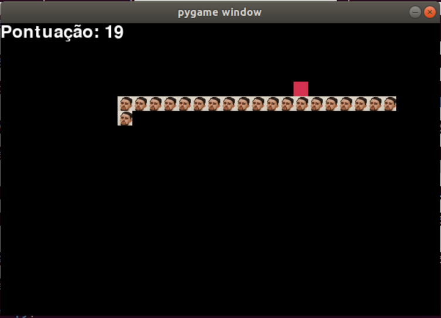

# Snake Game com Sprite (Pygame) 🐍

Este projeto é um jogo clássico de Snake desenvolvido em Python utilizando a biblioteca **Pygame**. A principal característica deste jogo é o uso de sprites personalizados para representar a cobra.

---

## 🔹 Requisitos 

-  [Py game](https://img.shields.io/badge/Pygame)

```bash
pip install pygame
```

---

## 🎮 Como Jogar 

1. Execute o arquivo do jogo:

   ```bash
   python snake.py
   ```

2. Use as setas do teclado para controlar a direção da cobra:
   - ⬆️ **Seta para cima**: Move para cima.
   - ⬇️ **Seta para baixo**: Move para baixo.
   - ⬅️ **Seta para esquerda**: Move para a esquerda.
   - ➡️ **Seta para direita**: Move para a direita.

3. **🍖 Coma a comida** (quadrado vermelho) para aumentar a pontuação e o tamanho da cobra.

4. **⚠️ Evite colisões** com as bordas da tela ou com o próprio corpo da cobra.

5. **🔰 Opções após o fim do jogo**:
   - Pressione **C** para reiniciar.
   - Pressione **Q** para sair.

---

## Funcionalidades ⭐

- **Sprites Personalizados**: A cobra é representada por uma imagem sprite (`player.png`).
- **Pontuação em Tempo Real**: A pontuação é exibida no topo da tela.
- **Velocidade Ajustável**: O jogo utiliza a variável `SPEED` para definir a velocidade do movimento.

---

## 🧩 Estrutura do Código 

### Cores e Dimensões
Configurações básicas do jogo:

```python
# Define as cores (RGB)
WHITE = (255, 255, 255)
BLACK = (0, 0, 0)
RED = (213, 50, 80)
GREEN = (0, 255, 0)
BLUE = (50, 153, 213)

# Dimensões da tela
WIDTH = 600
HEIGHT = 400
screen = pygame.display.set_mode((WIDTH, HEIGHT))
```

### Funções Principais
- **`show_score(score)`**: Exibe a pontuação.
- **`draw_snake_with_sprites(snake_body)`**: Renderiza a cobra usando sprites.
- **`message(msg, color)`**: Exibe mensagens de fim de jogo.
- **`game_loop()`**: Contém a lógica principal do jogo.

---

## 📂 Dependências de Recursos 

Certifique-se de que o arquivo **`player.png`** (sprite da cobra) esteja presente na mesma pasta que o código. A imagem deve ter dimensões de **20x20 pixels** para exibição correta.

---

## 🔧 Personalizações 

- **Velocidade do Jogo**: Ajuste a variável `SPEED` para alterar a velocidade.
- **Tamanho dos Blocos**: Modifique `BLOCK_SIZE` para ajustar o tamanho da cobra e da comida.
- **Imagem Sprite**: Substitua `player.png` por outra imagem de mesma dimensão.

---

## 🎥 Exemplo de Tela do Jogo 



---

## 📜 Licença 

Este projeto está disponível sob a licença **MIT**. Sinta-se à vontade para modificá-lo e distribuí-lo livremente.
